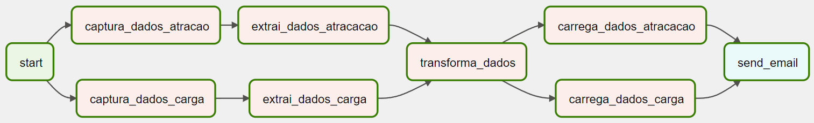
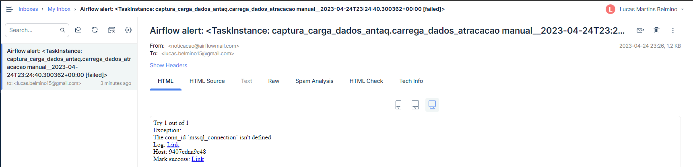
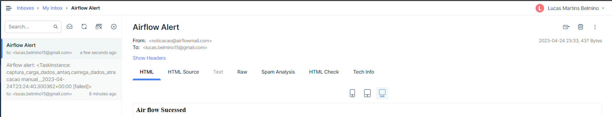

## Respostas das questões

Aqui estão as respostas das questões propostas.

---

## 1 - Auto-avaliação
### Tópicos de Conhecimento:
- Manipulação e tratamento de dados com Python: 
- Manipulação e tratamento de dados com Pyspark: 
- Desenvolvimento de data workflows em Ambiente Azure com databricks: 
- Desenvolvimento de data workflows com Airflow: 
- Manipulação de bases de dados NoSQL: 
- Web crawling e web scraping para mineração de dados: 
- Construção de APIs: REST, SOAP e Microservices: 

---

## 2 - Desenvolvimento de pipelines de ETL de dados com Python, Apache Airflow, Hadoop e Spark.
### Supondo que você seja nosso Cientista de dados:
##### a) Olhando para todos os dados disponíveis na fonte citada acima, em qual estrutura de banco de dados você orienta guardá-los no nosso Data Lake? SQL ou NoSQL? Discorra sobre sua orientação.

**Resposta:** É possível observar pelo dados, que se tratam de dados estruturados com formato fíxico. Desta forma, recomendaria a utilização de um bando de dados SQL.

##### b) Desenvolva um script em python que extraia os dados do anuário, e transforme-os em duas tabelas fato, atracacao_fato e carga_fato.

**Resposta:** Para atender os requisitos desta questão foram desenvolvidos scripts em python realizando cada um dos passos solicitados. Abaixo a descrição do passo a passo:
- **Captura dos Dados:**
    - captura_dados_atracacao.py
    - captura_dados_carga.py
- **Extração dos Dados (dados estão zipados):**
    - extrai_dados_atracacao.py
    - extrai_dados_carga.py
- **Transformação dos Dados:**
    - transforma_dados_atracacao.py
    - transforma_dados_carga.py

##### c) Criar uma consulta (query) otimizada.

**Resposta:** Para atender os requisitos foi desenvolvida a consulta SQL com o nome: `numero_atracacao_nordeste.sql`. Além disso foram implementados scripts em python que fazem a carga dos dados em um Banco de Dados SQL Server, `carrega_dados_atracacao.py` e  `carrega_dados_carga.py`.

---

## 3 - Criação de ambiente de desenvolvimento com Linux e Docker.

### Criação do ambiente

Para atender os requisitos desta questão foi elaborado uma infraestrutura em docker visando implementar os serviços de orquestração com o **Airflow** e Banco de dados com o **SQL Server**. Para isso utilizou-se do orquestrador de container Docker Compose. A configuração das aplicações encontre-se no arquivo `docker-compose.yml`. Para subir a infraestrutura utilize o comando:

```bash
docker-compose up -d --build
```

### Pipeline de ETL

A DAG do Airflow encontrasse na pasta `dags` com o nome `dag_captura_carga_dados_antaq.py`. Abaixo temos a sua visualização gráfica.

**DAG de ETL dos Dados da Antaq:**


### Email de Notificação

O serviço **Mail Trap** foi utilizado para o envio e o recebimento de e-mails. Foi implementado o envio de emails tanto em caso de erro como em caso de finalização da pipeline com sucesso.

**Email em caso de falha:**


**Email após a finalização da pipeline com sucesso:**


---

## 5 - Crie script´s de configuração, que seja capaz de implantar um servidor Kuberentes em um Ubuntu Server 20.04 e deploy de um serviço de Airflow.

### Considerações iniciais
O script de configuração desenvolvido: `script_airflow_kube.sh`

Para criar um script de configuração capaz de implantar um servidor Kubernetes em um Ubuntu Server 20.04 e fazer o deploy de um serviço de Airflow, é necessário seguir uma série de passos. Em primeiro lugar, é preciso instalar alguns serviços, como o Docker, Kubectl, Helm e Kind.

Após a instalação desses serviços, é necessário criar um arquivo kind-cluster.yaml para descrever o cluster Kubernetes que será criado pelo Kind. Em seguida, é preciso criar um arquivo Dockerfile para poder instalar diferentes providers necessários para o serviço de Airflow. Por fim, o serviço Airflow pode ser criado usando o comando Helm.

O script de configuração foi elaborado seguindo esses passos, garantindo que todos os serviços e arquivos necessários sejam instalados e criados corretamente para que o serviço de Airflow possa ser implantado e executado com sucesso no cluster Kubernetes.

### Descrição do script de configuração

- Criação dos arquivo `Dockerfile` e `kind-cluster.yaml`
    - Aqui são criados os arquivos Dockerfile e kind-cluster.yaml (Descritos abaixo)
- Instalações Necessárias:
    - Docker
    - Kubectl
    - Helm
    - Kind
- Criação do cluster
    - O cluster Kubernetes é criado usando a ferramenta Kind, as configurações do cluster são descritas no arquivo `kind-cluster.yaml`.
- Criação e Armazenamento de chave ssh (GitSync)
    - A criação de uma chave ssh é necessária para fazer a conexão com o Github e assim adquirir automaticamente as DAGs.
- Criação de imagem Docker
    - Aqui utilizaremos o `Dockerfile` criado anteriormente para criar uma imagem, o intuito é poder instalar pacotes necessários com `pip install`
- Criação do serviço
    - Utilizamos o Helm para criação do serviço de Airflow
- Chave SSH e Mapeamento de porta
    - No final do script é apresentada uma chave SSH, essa chave deve ser copiada em Seu Repositorio Github > Setting > Deploy Key para permitir a aquisição automatica das DAGs.
    - Por fim é mapeada a porta 8080 do airflow-webserver

### Script de configuração

Abaixo o script completo.

```bash
# Criação dos arquivo Dockerfile e kind-cluster.yaml
cat <<EOM > Dockerfile
FROM apache/airflow:2.2.4

RUN pip install --no-cache-dir apache-airflow-providers-microsoft-mssql
RUN pip install --no-cache-dir pymssql
RUN pip install --no-cache-dir apache-airflow-providers-odbc
EOM

cat <<EOM > kind-cluster.yaml
kind: Cluster
apiVersion: kind.x-k8s.io/v1alpha4
containerdConfigPatches:
- |-
  [plugins."io.containerd.grpc.v1.cri".registry.mirrors."localhost:${reg_port}"]
    endpoint = ["http://${reg_name}:${reg_port}"]
nodes:
- role: control-plane
- role: worker
  kubeadmConfigPatches:
  - |
    kind: JoinConfiguration
    nodeRegistration:
      kubeletExtraArgs:
        node-labels: "node=worker_1"
- role: worker
  kubeadmConfigPatches:
  - |
    kind: JoinConfiguration
    nodeRegistration:
      kubeletExtraArgs:
        node-labels: "node=worker_2"
- role: worker
  kubeadmConfigPatches:
  - |
    kind: JoinConfiguration
    nodeRegistration:
      kubeletExtraArgs:
        node-labels: "node=worker_3"
EOM

# Install Docker
sudo apt update
sudo apt install docker.io -y

# Grant permission to User
sudo groupadd docker
sudo gpasswd -a $USER docker

# Instal kubectl
curl -LO "https://dl.k8s.io/release/$(curl -L -s https://dl.k8s.io/release/stable.txt)/bin/linux/amd64/kubectl"
curl -LO "https://dl.k8s.io/$(curl -L -s https://dl.k8s.io/release/stable.txt)/bin/linux/amd64/kubectl.sha256"
echo "$(cat kubectl.sha256)  kubectl" | sha256sum --check
sudo install -o root -g root -m 0755 kubectl /usr/local/bin/kubectl

# Install helm
curl -fsSL -o get_helm.sh https://raw.githubusercontent.com/helm/helm/main/scripts/get-helm-3
chmod 700 get_helm.sh
./get_helm.sh

# Install kind
curl -Lo ./kind https://kind.sigs.k8s.io/dl/v0.18.0/kind-linux-amd64
chmod +x ./kind
sudo mv ./kind /usr/local/bin/kind

# Create a kubernetes cluster of 1 control plane and 3 worker nodes
sudo kind create cluster --name airflow-cluster --config kind-cluster.yaml

# Add the official repository of the Airflow Helm Chart
sudo helm repo add apache-airflow https://airflow.apache.org

# Update the repo
sudo helm repo update

# Create namespace airflow
sudo kubectl create namespace airflow

# Create a key
sudo ssh-keygen -t rsa -N "" -f ~/.ssh/id_rsa

# Create a Secret
sudo kubectl create secret generic airflow-ssh-git-secret --from-file=gitSshKey=.ssh/id_rsa -n airflow

# Adicione a chave publica em Repo > Settings > Deploy keys
sudo cat .ssh/id_rsa.pub

# Create Dockerfile
# Create Image
sudo docker build -t airflow_custom:1.0.0 .

# Load image into cluster
sudo kind load docker-image airflow_custom:1.0.0 --name airflow-cluster

sudo helm install airflow apache-airflow/airflow -n airflow \
--set images.airflow.repository=airflow_custom \
--set images.airflow.tag=1.0.0 \
--set dags.gitSync.enabled=true \
--set dags.gitSync.repo=git@github.com:belmino15/antaq_data_lake.git \
--set dags.gitSync.branch=master \
--set dags.gitSync.depth=0 \
--set dags.gitSync.subPath="dags" \
--set dags.gitSync.sshKeySecret=airflow-ssh-git-secret \
--debug

# Printa Chave ssh e Mapea Porta
sudo cat .ssh/id_rsa.pub
sudo kubectl port-forward svc/airflow-webserver --address 0.0.0.0 8080:8080 -n airflow --context kind-airflow-cluster
```

### Considerações finais
Algumas considerações sobre o script:
- Visando uma implementação em produção aconselhasse utilizar outra ferramenta, o Kind é uma ferramenta para uso local de clusters Kubernetes e foi primariamente desenhada para testar o Kubernetes.
- A utilização dos privilégios de super usuário com `sudo` pode ser perigosa caso não confie nos scripts executados.
- A execução do script foi testada em uma Instância do serviço AWS EC2, observações:
    - AMI: Ubuntu Server 20.04 LTS (HVM)
    - Instance Type: t2.xlarge
    - Storage: 50Gb (Usa em geral de 24Gb)
    - É necessário liberar a porta 8080 no Security Group
    - Copie/Crie o scrip dentro da instancia (com `nano sript.sh`, por exemplo), de permissão ao arquivo `chmod +x sript.sh` e execute `./script.sh`


